# PPT Screenshots

## Slide 1: AI 时代独立 Solo 开发的核心优势与现状

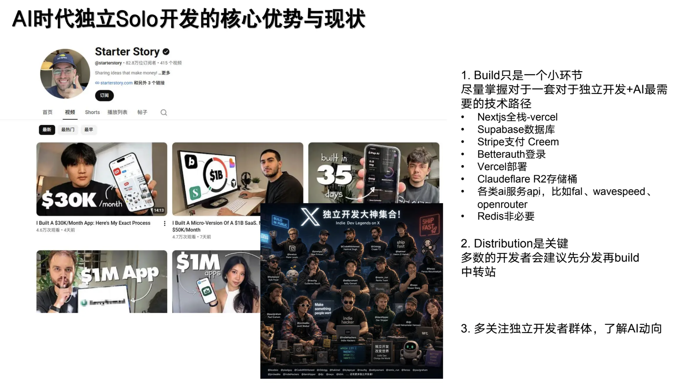

## Slide 2: 轻量小 SaaS 与流量型工具站

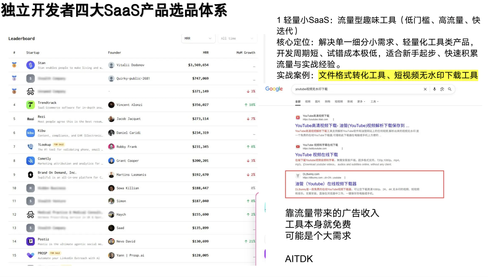

## Slide 3: 中型 API 聚合 SaaS 与垂直 Niche SaaS

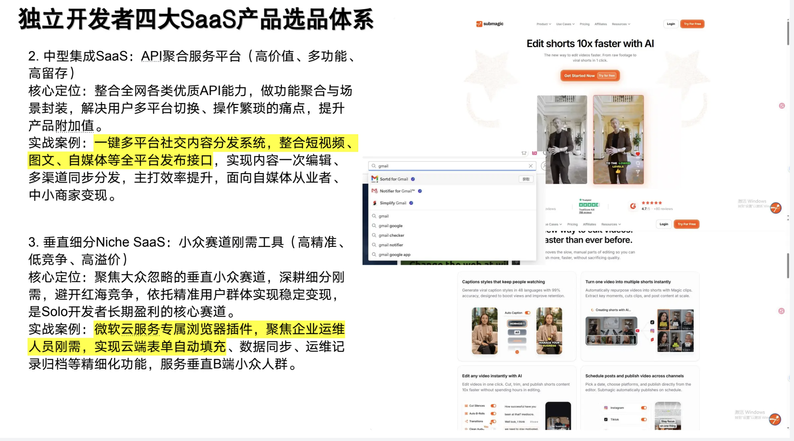

## Slide 4: 数字产品电商 SaaS

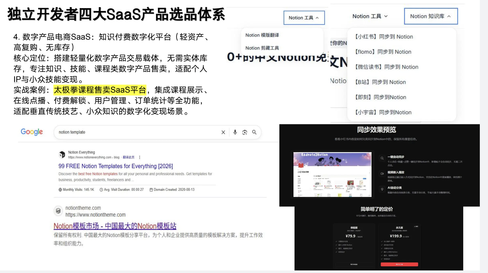

## Slide 5: AI SaaS 与传统 SaaS 的商业模式差异

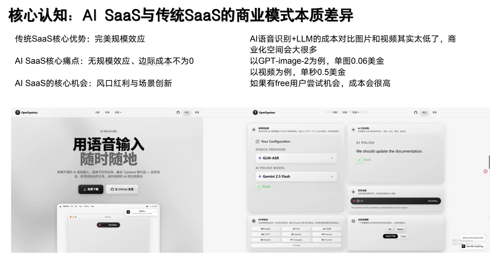

## Slide 6: AI 图片/视频工具站与套壳价值

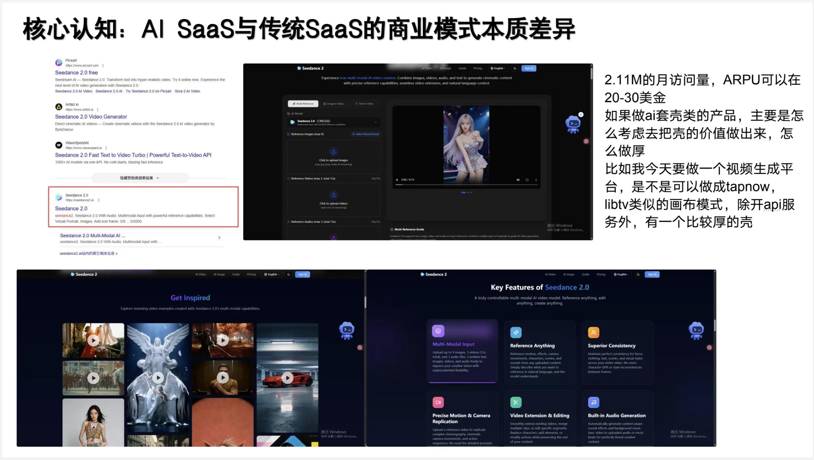

## Slide 7: 个人 AI Coding Harness 工作流

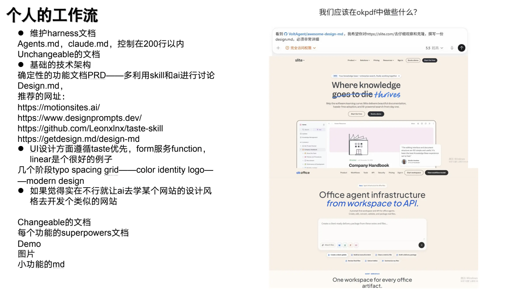

## Slide 8: Landing Page 的 Design.md 工作流

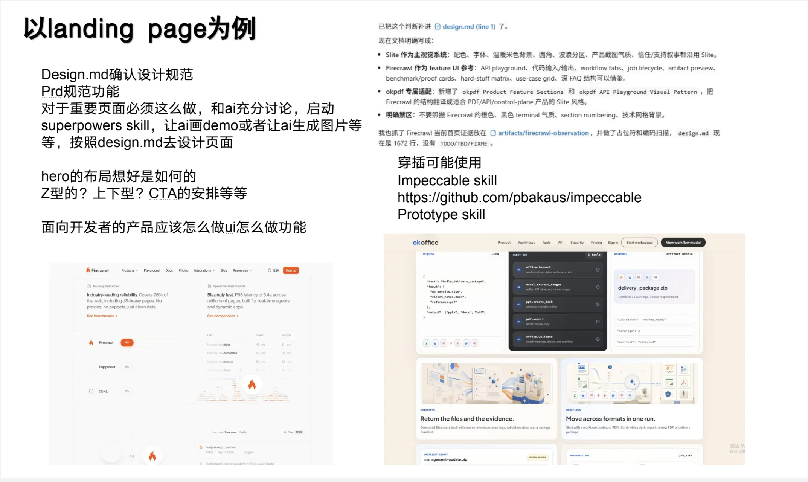

## Slide 9: 多模态生成页面与 Impeccable Skill 案例

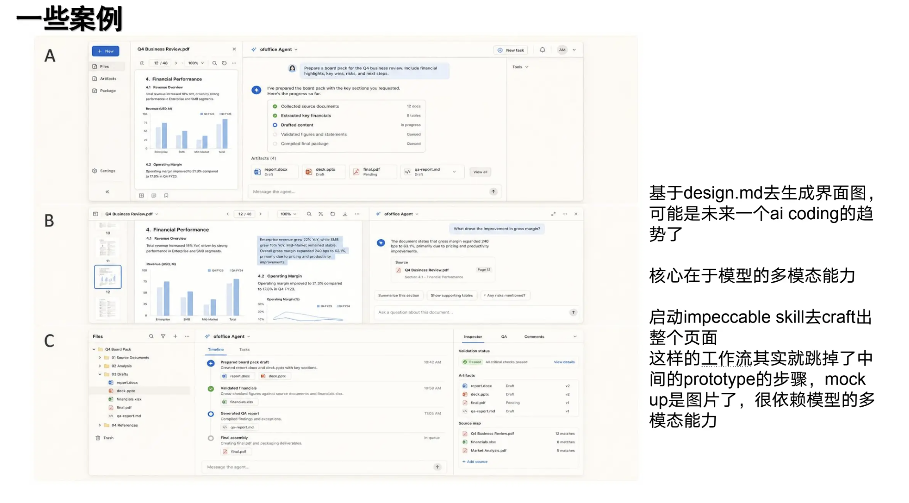

## Slide 10: 后端业务流、TDD 和文档入口

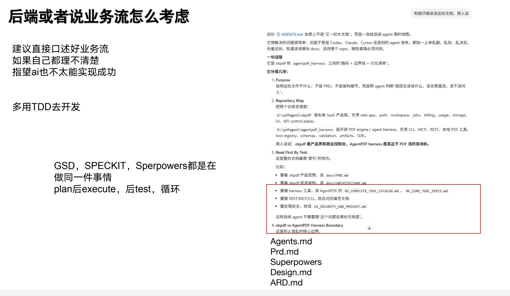

## Slide 11: 增长渠道与已验证 Idea 的再设计

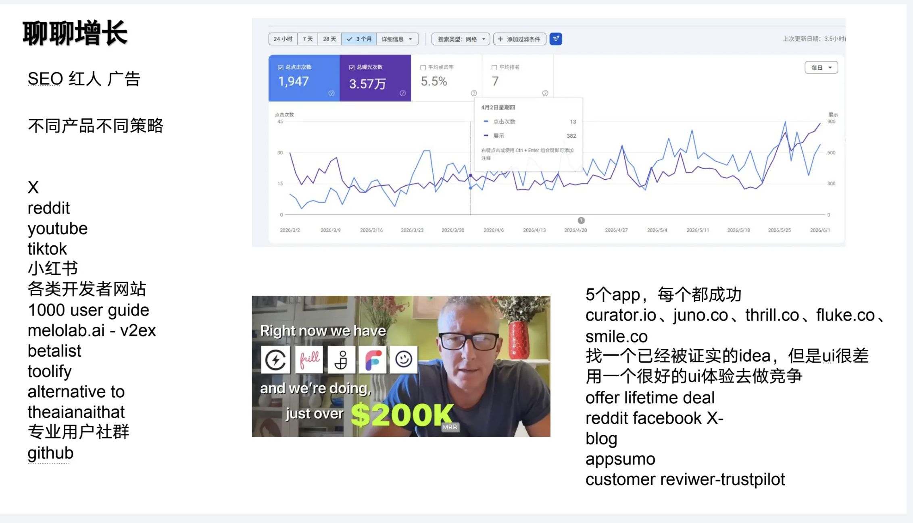
